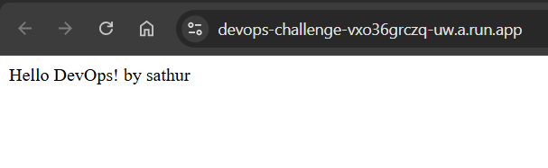
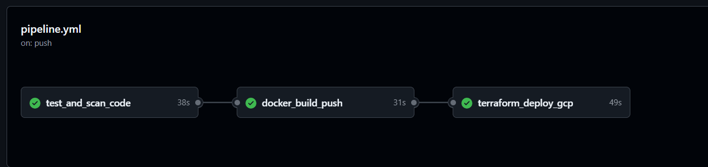
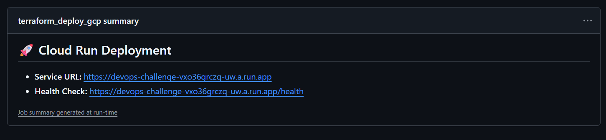

# DevOps Challenge – Cloud Run CI/CD

## Overview

This repository contains a simple Python Flask web service, containerized using Docker, and deployed using a CI/CD pipeline built with GitHub Actions.  
Infrastructure is provisioned using Terraform and targets **Google Cloud Run** following least-privilege and best-practice principles.

The goal of this project is to demonstrate:
- Clean CI/CD design
- Secure container and infrastructure practices
- Infrastructure as Code
- Cloud Run deployment readiness

---

## Application Details

**Language:** Python (Flask)

**Endpoints:**
- `GET /health` → `{ "status": "OK" }`
- `GET /` → `Hello DevOps!`

The application is intentionally minimal to keep the focus on CI/CD, security, and infrastructure.



**Service URL:** https://devops-challenge-vxo36grczq-uw.a.run.app

**Health Check:** https://devops-challenge-vxo36grczq-uw.a.run.app/health

---

## Running Locally

### Prerequisites
- Docker
- Docker Compose (optional)

### Run using Docker
```bash
docker build -t devops-challenge .
docker run -p 8080:8080 devops-challenge
```

### Docker Image

- Multi-stage Docker build to reduce image size
- Uses a slim base image
- Runs as a non-root user
- Final image size is kept under 200 MB

## Infrastructure (Terraform)

All infrastructure code lives under the /iac directory.

Terraform provisions:

- Artifact Registry repository
- Dedicated service account with least-privilege IAM for Cloud Run
- Cloud Run service
    - Single revision
    - minScale = 0

Security scanning is performed using **tfsec** to ensure there are no critical or high-risk misconfigurations.
All checks pass with no critical findings.

**Validation**

The following commands run successfully:
```bash
terraform init
terraform fmt
terraform validate
tfsec
terraform plan -out=planfile -lock=false
terraform apply
```

## CI/CD Pipeline (GitHub Actions)

Pipeline configuration: .github/workflows/pipeline.yml



### Pipeline Stages

**1. Test & Scan**

- Unit tests executed using pytest
- Security scanning using Bandit
- Static code analysis using SonarQube
- Pipeline fails if critical security issues are detected


**2. Build & Push Image**

- Multi-stage Docker image build
- Image tagged with commit SHA
- Image pushed to docker Registry


**3. Infrastructure & Deployment**

- Terraform format, validate, and plan
- Cloud Run service is created and deployed
- Application becomes reachable via public Cloud Run URL
- Cloud Run URL is published in the GitHub Actions job summary



## Observability & Monitoring


**The service relies on Google Cloud Run’s built-in observability features.**

- **Logging:** Application and request logs are written to stdout and collected automatically by Cloud Logging.
- **Metrics:** Cloud Run exports request count, latency, error rate, and instance metrics to Cloud Monitoring.
- **Health Checks:** A /health endpoint is exposed and validated in CI to ensure service readiness.

**High Availability & Reliability**

- Cloud Run provides regional, multi-zone high availability by default.
- The service is stateless, allowing automatic horizontal scaling.
- Autoscaling is configured with minScale = 0 to optimize cost.
- In production, alerting policies would be configured for high error rate and latency thresholds.
- Cloud Logging for application and access logs
- Cloud Monitoring for:
    - Request count
    - Error rate
    - Latency
- Health endpoint (/health) enables uptime checks
- Cloud Run auto-scaling handles traffic spikes while maintaining cost efficiency


## Security Considerations

- Non-root container execution
- Least-privilege IAM for Cloud Run service account
- Static code scanning (Bandit, SonarQube)
- No hard-coded secrets or project IDs
- Terraform code formatted and validated


## Trade-offs & Decisions

- Kept application logic minimal to focus on CI/CD and infrastructure
- Chose Cloud Run for simplicity, scalability, and cost efficiency
- Terraform apply is automated only through CI to avoid configuration drift


## Recommendation: Infrastructure and Application Separation

For production environments, it is recommended to separate **infrastructure code** and **application code** into different repositories.

### Proposed Approach

**Infrastructure Repository**
- Contains all Terraform code for shared and environment-specific resources
- Infrastructure is deployed first (Artifact Registry, IAM, Cloud Run service, networking, etc.)
- Changes are controlled and applied independently
- Enables stronger governance, reviews, and access control

**Application Repository**
- Contains application source code, Dockerfile, and CI pipeline
- Builds, tests, and scans the application
- Builds and pushes the container image to Artifact Registry
- Triggers a deployment by updating the Cloud Run service with the new image

### Benefits

- Clear separation of responsibilities (platform vs application)
- Reduced risk of accidental infrastructure changes during app releases
- Faster and safer application deployments
- Easier multi-environment support (dev, stage, prod)
- Better alignment with enterprise CI/CD and GitOps practices
